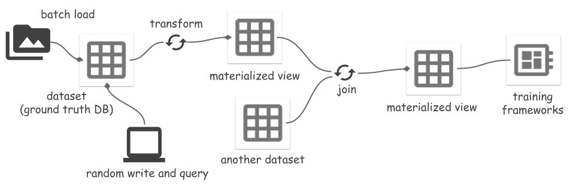

# Space: Unified Storage for Machine Learning

[](https://github.com/google/space/actions/workflows/python-ci.yml)

<hr/>

Unify data in your entire machine learning lifecycle with **Space**, a comprehensive storage solution that seamlessly handles data from ingestion to training.

**Key Features:**
- **Ground Truth Database**
  - Store and manage data in open source file formats, locally or in the cloud.
  - Ingest from various sources, including ML datasets, files, and labeling tools.
  - Support data manipulation (append, insert, update, delete) and version control.
- **OLAP Database and Lakehouse**
  - [Iceberg](https://github.com/apache/iceberg) style [open table format](/docs/design.md#metadata-design).
  - Optimized for unstructued data via [reference](./docs/design.md#data-files) operations.
  - Quickly analyze data using SQL engines like [DuckDB](https://github.com/duckdb/duckdb).
- **Distributed Data Processing Pipelines**
  - Integrate with processing frameworks like [Ray](https://github.com/ray-project/ray) for efficient data transformation.
  - Store processed results as Materialized Views (MVs); incrementally update MVs when the source is changed.
- **Seamless Training Framework Integration**
  - Access Space datasets and MVs directly via random access interfaces.
  - Convert to popular ML dataset formats (e.g., [TFDS](https://github.com/tensorflow/datasets), [HuggingFace](https://github.com/huggingface/datasets), [Ray](https://github.com/ray-project/ray)).



## Onboarding Examples

- [Manage Tensorflow COCO dataset](notebooks/tfds_coco_tutorial.ipynb)
- [Ground truth database of LabelStudio](notebooks/label_studio_tutorial.ipynb)
- [Transforms and materialized views: Segment Anything as example](notebooks/segment_anything_tutorial.ipynb)
- [Incrementally build embedding vector indexes](notebooks/incremental_embedding_index.ipynb)

## Space 101

- Space uses [Arrow](https://arrow.apache.org/docs/python/index.html) in the API surface, e.g., schema, filter, data IO.
- All file paths in Space are [relative](./docs/design.md#relative-paths); datasets are immediately usable after downloading or moving.
- Space stores data itself, or a reference of data, in Parquet files. The reference can be the address of a row in ArrayRecord file, or the path of a standalone file (limitted support, see `space.core.schema.types.files`).
- `space.TfFeatures` is a built-in field type providing serializers for nested dicts of numpy arrays, based on [TFDS FeaturesDict](https://www.tensorflow.org/datasets/api_docs/python/tfds/features/FeaturesDict).
- Please find more information in [the design page](docs/design.md).

## Quick Start

- [Install](#install)
- [Cloud Storage](#cloud-storage)
- [Cluster setup](#cluster-setup)
- [Create and Load Datasets](#create-and-load-datasets)
- [Write and Read](#write-and-read)
- [Transform and Materialized Views](#transform-and-materialized-views)
- [ML Frameworks Integration](#ml-frameworks-integration)
- [Inspect Metadata](#inspect-metadata)

### Install

Install:
```bash
pip install space-datasets
```

Or install from code:
```bash
cd python
pip install .[dev]
```

### Cloud Storage

Optionally, setup [GCS FUSE](https://cloud.google.com/storage/docs/gcs-fuse) to use files on Google Cloud Storage (GCS) (or [S3](https://github.com/s3fs-fuse/s3fs-fuse), [Azure](https://github.com/Azure/azure-storage-fuse)):

```bash
gcsfuse <mybucket> "/path/to/<mybucket>"
```

Space has not yet implemented Cloud Storage file systems. FUSE is the current suggested approach.

### Cluster Setup

Optionally, setup a cluster to run Space operations distributedly. We support Ray clusters, on the Ray cluster head/worker nodes:
```bash
# Start a Ray head node (IP 123.45.67.89, for example).
# See https://docs.ray.io/en/latest/ray-core/starting-ray.html for details.
ray start --head --port=6379
```

Using [Cloud Storage + FUSE](#cloud-storage) is required in the distributed mode, because the Ray cluster and the client machine should operate on the same directory of files. Run `gcsfuse` on all machines and the mapped local directory paths **must be the same**.

Run the following code on the client machine to connect to the Ray cluster:
```py
import ray
# Connect to the Ray cluster.
ray.init(address="ray://123.45.67.89:10001")
```

### Create and Load Datasets

Create a Space dataset with two index fields (`id`, `image_name`) (store in Parquet) and a record field (`feature`) (store in ArrayRecord).

This example uses the plain `binary` type for the record field. Space supports a type `space.TfFeatures` that integrates with the [TFDS feature serializer](https://www.tensorflow.org/datasets/api_docs/python/tfds/features/FeaturesDict). See more details in a [TFDS example](/notebooks/tfds_coco_tutorial.ipynb).

```py
import pyarrow as pa
from space import Dataset

schema = pa.schema([
  ("id", pa.int64()),
  ("image_name", pa.string()),
  ("feature", pa.binary())])

ds = Dataset.create(
  "/path/to/<mybucket>/example_ds",
  schema,
  primary_keys=["id"],
  record_fields=["feature"])  # Store this field in ArrayRecord files

# Load the dataset from files later:
ds = Dataset.load("/path/to/<mybucket>/example_ds")
```

Optionally, you can use `catalogs` to manage datasets by names instead of locations:

```py
from space import DirCatalog

# DirCatalog manages datasets in a directory.
catalog = DirCatalog("/path/to/<mybucket>")

# Same as the creation above.
ds = catalog.create_dataset("example_ds", schema,
  primary_keys=["id"], record_fields=["feature"])

# Same as the load above.
ds = catalog.dataset("example_ds")

# List all datasets and materialized views.
print(catalog.datasets())
```

### Write and Read

Append, delete some data. Each mutation generates a new version of data, represented by an increasing integer ID. We expect to support the [Iceberg](https://iceberg.apache.org/docs/latest/branching/) style tags and branches for better version management.
```py
import pyarrow.compute as pc
from space import RayOptions

# Create a local runner:
runner = ds.local()

# Or create a Ray runner:
runner = ds.ray(ray_options=RayOptions(max_parallelism=8))

# To avoid https://github.com/ray-project/ray/issues/41333, wrap the runner 
# with @ray.remote when running in a remote Ray cluster.
#
# @ray.remote
# def run():
#   return runner.read_all()
#

# Appending data generates a new dataset version `snapshot_id=1`
# Write methods:
# - append(...): no primary key check.
# - insert(...): fail if primary key exists.
# - upsert(...): overwrite if primary key exists.
ids = range(100)
runner.append({
  "id": ids,
  "image_name": [f"{i}.jpg" for i in ids],
  "feature": [f"somedata{i}".encode("utf-8") for i in ids]
})
ds.add_tag("after_append")  # Version management: add tag to snapshot

# Deletion generates a new version `snapshot_id=2`
runner.delete(pc.field("id") == 1)
ds.add_tag("after_delete")

# Show all versions
ds.versions().to_pandas()
# >>>
#    snapshot_id               create_time tag_or_branch
# 0            2 2024-01-12 20:23:57+00:00  after_delete
# 1            1 2024-01-12 20:23:38+00:00  after_append
# 2            0 2024-01-12 20:22:51+00:00          None

# Read options:
# - filter_: optional, apply a filter (push down to reader).
# - fields: optional, field selection.
# - version: optional, snapshot_id or tag, time travel back to an old version.
runner.read_all(
  filter_=pc.field("image_name")=="2.jpg",
  fields=["feature"],
  version="after_add"  # or snapshot ID `1`
)

# Read the changes between version 0 and 2.
for change_type, data in runner.diff(0, "after_delete"):
  print(change_type)
  print(data)
  print("===============")
```

### Transform and Materialized Views

Space supports transforming a dataset to a view, and materializing the view to files. The transforms include:

- Mapping batches using a user defined function (UDF).
- Filter using a UDF.
- Joining two views/datasets.

When the source dataset is modified, refreshing the materialized view incrementally synchronizes changes, which saves compute and IO cost. See more details in a [Segment Anything example](/notebooks/segment_anything_tutorial.ipynb). Reading or refreshing views must be the `Ray` runner, because they are implemented based on [Ray transform](https://docs.ray.io/en/latest/data/transforming-data.html).

A materialized view `mv` can be used as a view `mv.view` or a dataset `mv.dataset`. The former always reads data from the source dataset's files and processes all data on-the-fly. The latter directly reads processed data from the MV's files, skips processing data.

#### Example of map_batches

```py
# A sample transform UDF.
# Input is {"field_name": [values, ...], ...}
def modify_feature_udf(batch):
  batch["feature"] = [d + b"123" for d in batch["feature"]]
  return batch

# Create a view and materialize it.
view = ds.map_batches(
  fn=modify_feature_udf,
  output_schema=ds.schema,
  output_record_fields=["feature"]
)

view_runner = view.ray()
# Reading a view will read the source dataset and apply transforms on it.
# It processes all data using `modify_feature_udf` on the fly.
for d in view_runner.read():
  print(d)

mv = view.materialize("/path/to/<mybucket>/example_mv")
# Or use a catalog:
# mv = catalog.materialize("example_mv", view)

mv_runner = mv.ray()
# Refresh the MV up to version tag `after_add` of the source.
mv_runner.refresh("after_add")  # mv_runner.refresh() refresh to the latest version

# Use the MV runner instead of view runner to directly read from materialized
# view files, no data processing any more.
mv_runner.read_all()
```

#### Example of join

See a full example in the [Segment Anything example](/notebooks/segment_anything_tutorial.ipynb). Creating a materialized view of join result is not supported yet.

```py
# If input is a materialized view, using `mv.dataset` instead of `mv.view`
# Only support 1 join key, it must be primary key of both left and right.
joined_view = mv_left.dataset.join(mv_right.dataset, keys=["id"])
```

### ML Frameworks Integration

There are several ways to integrate Space storage with ML frameworks. Space provides a random access data source for reading data in ArrayRecord files:

```py
from space import RandomAccessDataSource

datasource = RandomAccessDataSource(
  # <field-name>: <storage-location>, for reading data from ArrayRecord files.
  {
    "feature": "/path/to/<mybucket>/example_mv",
  },
  # Don't auto deserialize data, because we store them as plain bytes.
  deserialize=False)

len(datasource)
datasource[2]
```

A dataset or view can also be read as a Ray dataset:
```py
ray_ds = ds.ray_dataset()
ray_ds.take(2)
```

Data in Parquet files can be read as a HuggingFace dataset:
```py
from datasets import load_dataset

huggingface_ds = load_dataset("parquet", data_files={"train": ds.index_files()})

```

### Inspect Metadata

List file path of all index (Parquet) files:
```python
ds.index_files()
# Or show more statistics information of Parquet files.
ds.storage.index_manifest()  # Accept filter and snapshot_id
```

Show statistics information of all ArrayRecord files:
```python
ds.storage.record_manifest()  # Accept filter and snapshot_id
```

## Status
Space is a new project under active development.

:construction: Ongoing tasks:
- Iceberg style version branches.
- Performance benchmark and improvement.

## Disclaimer
This is not an officially supported Google product.
