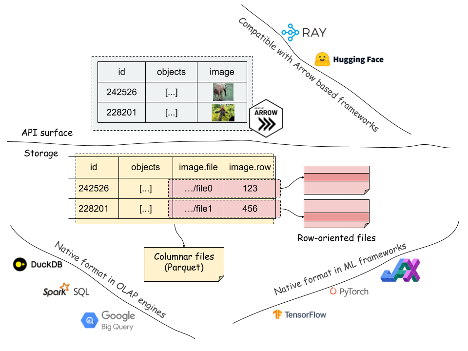

# Space: Storage Framework for Machine Learning Datasets

[](https://github.com/google/space/actions/workflows/python-ci.yml)

<hr/>

Space is a hybrid column/row oriented storage framework for Machine Learning datasets. It brings data warehouse/lake features, e.g., data mutation, version management, OLAP queries, materialized views, to ML datasets, for simplifying DataOps and MLOps.

For each row of data, Space stores bulky unstructured fields in random access row oriented format (record fields), and stores the addresses (pairs of file and row ID) together with the other fields in columnar files (index fields). By decoupling unstructured data and processing only addresses, it can efficiently support all OLAP/columnar style data operations, e.g., sorting, JOIN. It automatically read data from addresses in its APIs when needed, e.g., feed data into training frameworks.



## Ecosystem Integration

Space uses [Arrow](https://arrow.apache.org/docs/python/index.html) in the API surface, e.g., schema, filter, data IO. It supports the following file formats:

- [Parquet](https://parquet.apache.org/) for storing columnar data.
- [ArrayRecord](https://github.com/google/array_record), a high-performance random access row format for ML training. [ArrayRecord](https://www.tensorflow.org/datasets/tfless_tfds) is the successor format in [Tensorflow Datasets](https://www.tensorflow.org/datasets) after [TFRecord](https://www.tensorflow.org/tutorials/load_data/tfrecord).

Because these file formats are native for the most popular OLAP engines and ML frameworks, ecosystem integration is easy: data can be moved between Space and other frameworks, with zero or minimized file rewrite. In addition, Space can be easily integrated with frameworks using Arrow, e.g., [Ray](https://docs.ray.io/en/latest/index.html). Data operations in Space can run locally, or distributedly in Ray clusters.

We expect to support more file formats (e.g., [TFRecord](https://www.tensorflow.org/tutorials/load_data/tfrecord), [Lance](https://github.com/lancedb/lancedb)) and compute frameworks (e.g., [Dask](https://www.dask.org/)) in future.

## Table Format Design

Data warehouse/lake features are empowered by a simple, copy-on-write open table format. Its metadata files use [Protobuf](https://protobuf.dev/) and Parquet files. The metadata Parquet files (aka, manifest files) store the information of data files, i.e., file path, storage statistics, and column statistics (min, max). One row represents one data file. There are two types of manifest files, for index/record fields respectively.

Users can query the manifest files as Arrow tables to get insights of the storage (method `index_manifest`). See more details in the [Segment Anything example](/notebooks/segment_anything_tutorial.ipynb).

Space uses **relative file paths** everywhere in metadata that gives us superior portability. A Space dataset stored in Cloud Storage can be mapped to local files using [FUSE](https://en.wikipedia.org/wiki/Filesystem_in_Userspace). And it is immediately usable after being downloaded or moved.

## Quick Start

### Install and Setup

Install from code:
```bash
cd python
pip install .[dev]
```

Optionally, setup [GCS FUSE](https://cloud.google.com/storage/docs/gcs-fuse) to use files on Google Cloud Storage (GCS) (or [S3](https://github.com/s3fs-fuse/s3fs-fuse), [Azure](https://github.com/Azure/azure-storage-fuse)):

```bash
gcsfuse <mybucket> "/path/to/<mybucket>"
```

Space has not yet implemented Cloud Storage file systems. FUSE is the current suggested approach.

### Create empty dataset

Create a Space dataset with two index fields (`id`, `image_name`) (store in Parquet) and a record field (`feature`) (store in ArrayRecord).

This example uses the plain `binary` type for the record field. Space supports a type `space.TfFeatures` that integrates with the [TFDS feature serializer](https://www.tensorflow.org/datasets/api_docs/python/tfds/features/FeaturesDict). See more details in a [TFDS example](/notebooks/tfds_coco_tutorial.ipynb).

```py
import pyarrow as pa
from space import Dataset

schema = pa.schema([
  ("id", pa.int64()),
  ("image_name", pa.string()),
  ("feature", pa.binary())])

ds = Dataset.create(
  "/path/to/<mybucket>/example_ds",
  schema,
  primary_keys=["id"],
  record_fields=["feature"])

# Load the dataset from files later:
# ds = Dataset.load("/path/to/<mybucket>/example_ds")
```

### Read and write data

Append, delete some data. Each mutation generates a new version of data, represented by an increasing integer ID. We expect to support the [Iceberg](https://iceberg.apache.org/docs/latest/branching/) style tags and branches for better version management.
```py
import pyarrow.compute as pc

# Create a local or Ray runner.
runner = ds.local()  # or ds.ray()

# Appending data generates a new dataset version `1`.
# Write methods:
# - append(...): no primary key check.
# - insert(...): fail if primary key exists.
# - upsert(...): override if primary key exists.
ids = range(100)
runner.append({
  "id": ids,
  "image_name": [f"{i}.jpg" for i in ids],
  "feature": [f"somedata{i}".encode("utf-8") for i in ids]
})

# Deletion generates a new version `2`.
runner.delete(pc.field("id") == 1)

# Obtain an iterator; read options:
# - filter_: optional, apply a filter (push down to reader).
# - fields: optional, field selection.
# - snapshot_id: optional, time travel back to an old version.
runner.read_all(
  filter_=pc.field("image_name")=="2.jpg",
  fields=["feature"],
  snapshot_id=1
)

# Read the changes between version 0 and 2.
for change_type, data in runner.diff(0, 2):
  print(change_type)
  print(data)
  print("===============")
```

### Transform and materialized views

Space supports transforming a dataset to a view, and materializing the view to files. When the source dataset is modified, refreshing the materialized view incrementally synchronizes changes, which saves compute and IO cost. See more details in a [Segment Anything example](/notebooks/segment_anything_tutorial.ipynb).

Reading or refreshing views must be the `Ray` runner, because they are implemented based on [Ray transform](https://docs.ray.io/en/latest/data/transforming-data.html).

```py
# A sample transform UDF.
# Input is {"field_name": [values, ...], ...}
def modify_feature_udf(batch):
  batch["feature"] = [d + b"123" for d in batch["feature"]]
  return batch

# Create a view and materialize it.
view = ds.map_batches(
  fn=modify_feature_udf,
  output_schema=ds.schema,
  output_record_fields=["feature"]
)

view_runner = view.ray()
# Reading a view will read the source dataset and apply transforms on it.
# It processes all data using `modify_feature_udf` on the fly.
for d in view_runner.read():
  print(d)

mv = view.materialize("/path/to/<mybucket>/example_mv")

mv_runner = mv.ray()
# Refresh the MV up to version `1`.
mv_runner.refresh(1)  # mv_runner.refresh() refresh to the latest version

# Use the MV runner instead of view runner to directly read from materialized
# view files, no data processing any more.
mv_runner.read_all()
```

### ML frameworks integration

There are several ways to integrate Space storage with ML frameworks. Space provides a random access data source for reading data in ArrayRecord files:

```py
from space import RandomAccessDataSource

datasource = RandomAccessDataSource(
  # <field-name>: <storage-location>, for reading data from ArrayRecord files.
  {
    "feature": "/path/to/<mybucket>/example_mv",
  },
  # Don't auto deserialize data, because we store them as plain bytes.
  deserialize=False)

len(datasource)
```

A dataset or view can also be read as a Ray dataset:
```py
ray_ds = ds.ray_dataset()
ray_ds.take(2)
```

Data in Parquet files can be read as a HuggingFace dataset:
```py
from datasets import load_dataset

huggingface_ds = load_dataset("parquet", data_files={"train": ds.index_files()})

```

## More readings

### Examples
- [Load TFDS datasets into Space: COCO as example](notebooks/tfds_coco_tutorial.ipynb)
- [Load custom data and build transform pipeline: Segment Anything as example](notebooks/segment_anything_tutorial.ipynb)

## Staus
Space is a new project under active development.

## Disclaimer
This is not an officially supported Google product.
