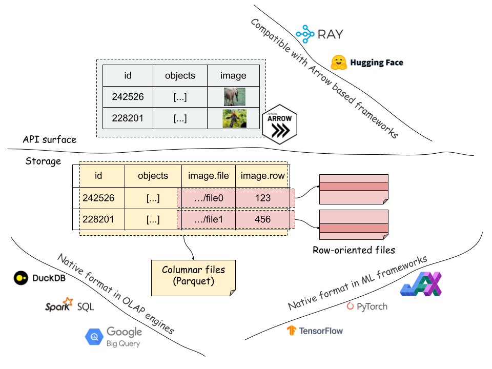

## Space Storage Design

### Data Files

Space has a hybrid column/row oriented storage layer. For each row of data, Space stores bulky unstructured fields in random access row oriented format (record fields), and stores the addresses (pairs of file and row ID) together with the other fields in columnar files (index fields). By decoupling unstructured data and processing only addresses, it can efficiently support all OLAP/columnar style data operations, e.g., sort, join. It automatically reads data from addresses in its APIs when needed, e.g., feed data into training frameworks.

Space supports the following file formats:

- [Parquet](https://parquet.apache.org/) for storing columnar data.
- [ArrayRecord](https://github.com/google/array_record), a high-performance random access row format for ML training. [ArrayRecord](https://www.tensorflow.org/datasets/tfless_tfds) is the successor format in [Tensorflow Datasets](https://www.tensorflow.org/datasets) after [TFRecord](https://www.tensorflow.org/tutorials/load_data/tfrecord).

We expect to support more file formats (e.g., [TFRecord](https://www.tensorflow.org/tutorials/load_data/tfrecord), [Lance](https://github.com/lancedb/lance))

## Metadata Design

### Open Table Format

Data warehouse/lake features are empowered by a simple, copy-on-write open table format. Its metadata files use [Protobuf](https://protobuf.dev/) and Parquet files. The metadata Parquet files (aka, manifest files) store the information of data files, i.e., file path, storage statistics, and column statistics (min, max). One row represents one data file. There are two types of manifest files, for index/record fields respectively.

Users can query the manifest files as Arrow tables to get insights of the storage (method `index_manifest`). See more details in the [Segment Anything example](/notebooks/segment_anything_tutorial.ipynb).

### Relative Paths

Space uses **relative file paths** everywhere in metadata that gives us superior portability. A Space dataset stored in Cloud Storage can be mapped to local files using [FUSE](https://en.wikipedia.org/wiki/Filesystem_in_Userspace). And it is immediately usable after downloading or moving. It is perfect for incrementally publishing or sharing datasets.
